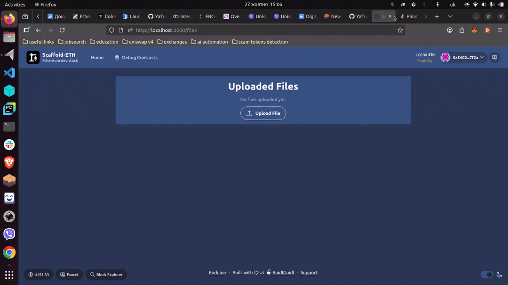

# 📁 Crypto Hybrid Encryption File Storage

Securely share encrypted documents on IPFS with on-chain access control built on **Scaffold-ETH 2**.

<div align="center">
  <!-- GitHub renders MP4s linked via markdown image syntax as an inline video player -->
  
  
  
  <!-- Fallback: link to high-res MP4 if you prefer → 1-2025-10-27_15.06.11.mp4 -->
  
  <p><em>End-to-end demo – upload, request and grant access in less than a minute.</em></p>
</div>

---

## ✨ Key Features

- **Client-side AES-256 encryption** – your plaintext never leaves the browser.
- **Per-user key wrapping via Lit Protocol** – share the file key without exposing it publicly.
- **IPFS + Pinata storage** – decentralised, permanent & CDN-accelerated delivery.
- **`FileRegistry` smart contract** – minimal on-chain registry that tracks files, requests and approvals.
- **Beautiful Next.js 13 (App Router) UI** – upload, preview and manage permissions with ease.
- **Scaffold-ETH 2 tool-chain** – contract hot-reload, hooks, components & burner wallet built-in.

---

## 🏗 Tech Stack

| Layer | Tech |
|-------|------|
| Smart Contracts | Solidity · Foundry · OpenZeppelin |
| Blockchain tooling | Hardhat (deps) · Forge scripts |
| Frontend | Next.js 13 (App Router) · TypeScript · TailwindCSS |
| Web3 | Wagmi · Viem · RainbowKit |
| Storage | IPFS · Pinata gateway |
| Crypto | Web Crypto API (AES-GCM) · Lit Protocol (ECIES) |

---

## 🚀 Quick Start

```bash
# 1. Install deps
$ yarn install

# 2. Start local Anvil chain (terminal 1)
$ yarn chain

# 3. Deploy FileRegistry (terminal 2)
$ yarn deploy

# 4. Launch the Next.js frontend (terminal 3)
$ yarn start
```

Browse to [http://localhost:3000](http://localhost:3000) → "Files" tab.

---

## 🔍 Project Structure

```text
packages/
  ├─ foundry/          # Solidity contracts, scripts & tests
  │   ├─ contracts/FileRegistry.sol
  │   └─ script/DeployFileRegistry.s.sol
  └─ nextjs/           # Next.js dApp frontend
      ├─ app/          # App Router pages
      ├─ hooks/        # Scaffold-ETH hooks (read/write, events…)
      └─ utils/upload/ # AES/Lit encryption helpers
```

### FileRegistry.sol (core contract)

```solidity
// simplified excerpt
contract FileRegistry {
    struct FileRecord {
        address owner;
        string cid;
        string fileType;
        string encKeyOwner; // AES key encrypted for owner
    }
    event FileUploaded(uint256 indexed fileId, address indexed owner, string cid, string encKeyOwner);
    event AccessRequested(uint256 indexed fileId, address indexed requester);
    event AccessApproved(uint256 indexed fileId, address indexed owner, address indexed grantee, string encKeyForRequester);
    // uploadFile, requestAccess, approveAccess …
}
```

---

## 📂 Usage Flow

1. **Upload** – user selects a file → browser encrypts it with a random AES-256 key → key is encrypted to the uploader’s wallet using Lit → encrypted file pushed to IPFS via `/api/files` → registry `uploadFile` is called.
2. **Request** – another user clicks the lock icon → calls `requestAccess(fileId)` on-chain.
3. **Grant** – owner decrypts AES key locally, re-encrypts it for requester via Lit, and calls `approveAccess`.
4. **Decrypt** – requester fetches encrypted file from IPFS, obtains wrapped key from contract, unwraps with Lit, and decrypts in browser.

---

## ⚙️ Environment Variables

Create `packages/nextjs/.env.local`:

```bash
# Pinata
PINATA_JWT=eyJhbGciOiJIUzI1NiIsInR…

# Lit Protocol (optional server key)
NEXT_PUBLIC_LIT_RELAY_API_KEY=…
```